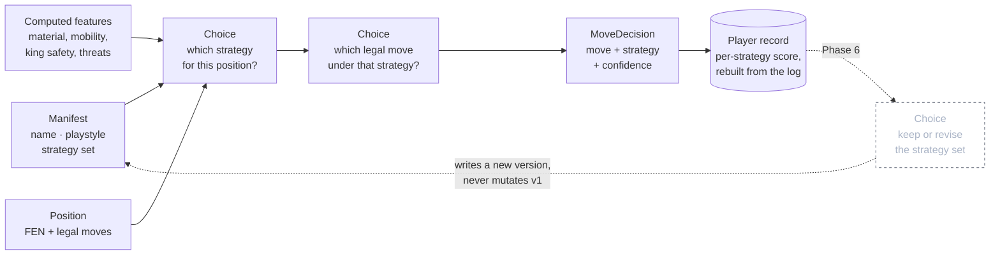
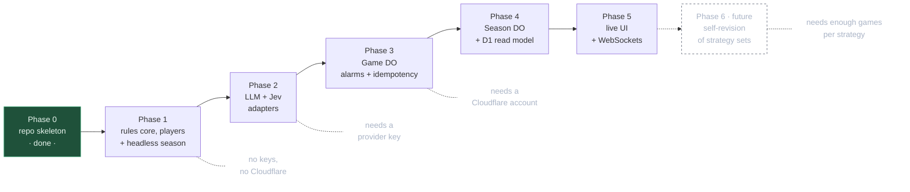
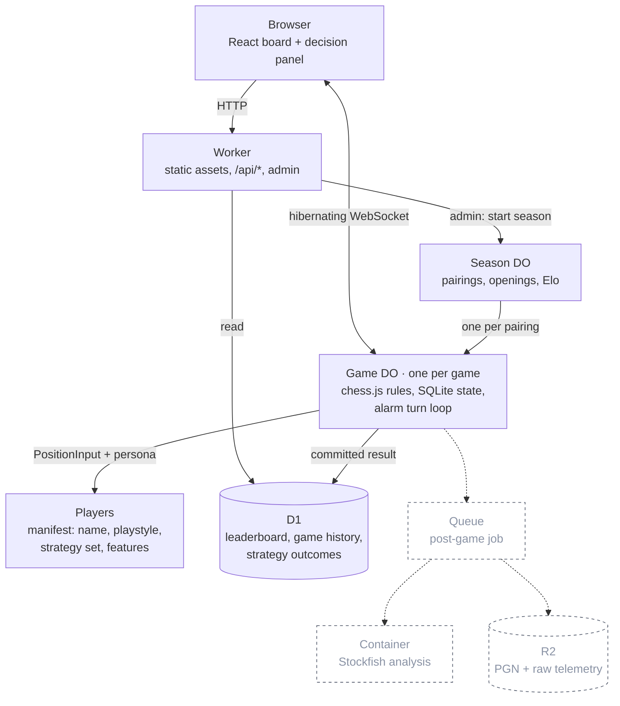
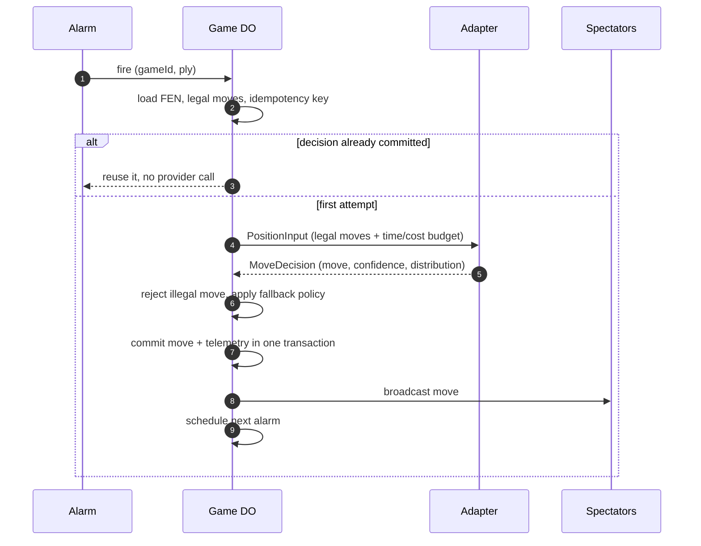

# System One Chess Arena — build plan

Ask: a repo and a plan for the arena described in the vault note
`Project Ideas/System One Chess Arena.md`.

What v1 has to prove: a season of games runs start to finish, every move is
legal, and each move leaves a decision record (chosen move, strategy,
confidence, probability distribution, latency, fallback used) so the players can
be compared on strength, speed and calibration. Every player is a named persona
with a declared playstyle and its own derived record, so results attach to an
identity rather than to an anonymous adapter. Strong chess is not a goal.

## The one contract

Everything else is plumbing around this. Adapters never touch the board.

```ts
interface CompetitorManifest {
  name: string;             // "Gambit Gwen"
  version: string;          // hash of this manifest; any field change bumps it
  model: string;            // "jev-latest" | "gpt-…" | "greedy" | "random"
  playstyle: string;        // prose persona, passed to the model as state
  strategies: string[];     // the closed set it may pick from (Choice caps at 255)
  features: string[];       // which computed facts it is allowed to see
  fallback: "random-legal" | "greedy" | "first-legal";
  budget: { maxMs: number; maxCostUsd?: number };
}

interface PlayerRecord {    // derived from committed games, never hand-authored
  competitor: string;
  version: string;
  games: number; wins: number; draws: number; losses: number;
  byColour: { white: number; black: number };          // score out of games played
  byStrategy: Record<string, { picks: number; score: number; avgConfidence: number }>;
}

interface PositionInput {
  gameId: string;
  ply: number;
  fen: string;
  history: string[];        // recent SAN, bounded
  legalMoves: string[];     // UCI, the only choices allowed
  features?: Record<string, number | string | boolean>;  // per-league contract
  persona: CompetitorManifest;
  record?: PlayerRecord;    // Phase 6 only: the player's own past results
  budget: { maxMs: number; maxCostUsd?: number };
}

interface MoveDecision {
  move: string;                            // must be in legalMoves
  confidence?: number;
  distribution?: Record<string, number>;   // move -> probability
  strategy?: string;                       // must be one of persona.strategies
  latencyMs: number;
  tokens?: { in: number; out: number };
  fallback?: "timeout" | "illegal-output" | "provider-error";
}

interface Competitor {
  manifest: CompetitorManifest;
  decide(input: PositionInput): Promise<MoveDecision>;
}
```

The game server owns rules via `chess.js` and rejects anything outside
`legalMoves`. A returned illegal move is recorded as `fallback:
"illegal-output"` and the declared fallback policy picks the move.

## Where strategies come from

Strategies are declared, never discovered. The model does no arithmetic and no
statistics: code computes the facts, the manifest says who the player is, and
the model only judges. Two players sharing one model and differing only by
manifest is the experiment, so the manifest is the unit of identity.

- **Playstyle** is prose in the manifest, passed as part of the state.
- **Strategy set** is a closed list in the manifest. A hierarchical player asks
  one `Choice` for the strategy, then one `Choice` for the move under it; a
  flat player skips the first question and records `strategy: "direct"`.
- **Features** are computed by code (material, mobility, king safety, hanging
  pieces, whether a capture is defended) and filtered to the list the manifest
  declares, so "what did this player know" is recorded rather than inferred.
- **History** is derived from committed games only, so it can always be rebuilt
  from the decision log. Nothing writes to a record directly.

The invariant that keeps self-revision honest: a manifest is immutable and its
version is a hash of its fields. When a player rewrites its own strategy set it
becomes a new version, and Elo plus history stay attributed to the version that
earned them. Mutating a manifest in place would let a self-revising player
launder a bad record.



Storage: Phase 1 keeps manifests as `competitors/*.json`, decisions as
`runs/<season>/decisions.jsonl`, and rebuilt records as
`runs/<season>/players/<name>@<version>.json`. Phase 4 moves the same three
shapes into D1 as `competitor_versions`, `games` and `strategy_outcomes`.

## Phases

Each phase ends with something runnable. No phase starts before the one above
it passes its check.



**Phase 0 — repo skeleton.** Done: Bun + TypeScript + Wrangler, one health
route, typecheck and `wrangler dev` both work.

**Phase 1 — rules core, players and headless season.** No Cloudflare at all. A
`chess.js` wrapper that builds `PositionInput` (including computed features
filtered by the manifest) and applies a validated `MoveDecision`; manifest
loading with hashed versions; three deterministic players — random,
material-greedy, and one scripted persona that picks a strategy from its own
set by rule, so the strategy and history plumbing is exercised before any model
exists; and a runner that plays N games, appends decisions as JSONL and rebuilds
every `PlayerRecord` from that log.
_Check:_ `bun run season --games 20` prints standings and an Elo table; the
JSONL has no illegal move and no missing terminal result; every decision carries
a strategy from its own manifest's set; and rebuilding the records from the log
reproduces them exactly, proving history is derived rather than authored.

**Phase 2 — model adapters.** A generative LLM adapter that gets the legal-move
list and must return one of them, and the Jev adapter written against the
`/v1/systemone` `Choice` shape. No `TYPESAFE_API_KEY` exists yet, so the Jev
adapter routes through the `system-one-adapter` contract against an ordinary
provider until a key arrives; swapping in the real endpoint is a base-URL
change.
_Check:_ LLM vs material-greedy completes a game; a deliberately illegal
response produces a logged fallback instead of a crash.

**Phase 3 — `Game` Durable Object.** Move the Phase 1 turn loop into a
SQLite-backed DO driven by alarms, with an idempotency key of
`(gameId, ply, competitorVersion)` so an at-least-once alarm reuses the
committed decision instead of calling the provider twice. Commit move plus
telemetry in one transaction, then broadcast.
_Check:_ interrupt a game mid-way and it resumes on the next alarm; a forced
duplicate alarm records one provider call, not two.

**Phase 4 — `Season` Durable Object and D1 read model.** Round-robin pairings
with colour reversal over 5 seeded openings, immutable competitor manifests,
plain Elo, and D1 tables for the public leaderboard, game history and
per-strategy outcomes (`competitor_versions`, `games`, `strategy_outcomes`).
_Check:_ one admin POST runs a 20-game season to completion; the leaderboard
endpoint returns standings that match the DO's own results, and per-strategy
scores match a recount from the decision log.

**Phase 5 — live UI.** Vite + React board served from Workers static assets,
one live game over hibernating WebSockets, and a panel showing the last
decision (move, strategy, confidence, latency).
_Check:_ two browsers see the same move land within a second of each other.

**Phase 6 (future) — self-revision.** Before a game the player is shown its own
`PlayerRecord` as state and asked one `Choice`: keep the strategy set, or adopt
a revision. A revision writes a new manifest version rather than editing the
old one, so `v1` keeps the rating it earned and the leaderboard can show both.
This only becomes meaningful once Phase 1's derived history and Phase 4's
per-strategy outcomes are trustworthy, and once enough games exist per strategy
to tell a real edge from variance.
_Check:_ a revision produces `v2`, `v1`'s record is byte-identical afterwards,
and both versions appear on the leaderboard.

## Runtime shape

Everything lives on Cloudflare. Dashed boxes are cut from v1 and have a place
to land later without moving anything else.



One turn, including the part that stops an at-least-once alarm from paying a
provider twice:



## Cut from the note's lean-first list

R2 artifact storage, the post-game Queue, the Stockfish container analysis
pass, Glicko-2 (plain Elo first), 20 openings down to 5, the GLiNER and
small-local adapters, and cost-per-dollar metrics. Latency, confidence and the
probability distribution stay, because they are the research artifact.

## Layout

```
competitors/          one JSON manifest per player (name, playstyle, strategies)
runs/<season>/        decisions.jsonl + players/<name>@<version>.json
src/
  index.ts            Worker entry: API routes, later static assets + WS upgrade
  core/               chess.js wrapper, features, contract types, validation
  players/            one file per adapter, all implementing Competitor
  season/             pairings, openings, Elo, record rebuilding
  do/                 Game and Season Durable Objects (Phase 3+)
scripts/season.ts     headless runner (Phase 1)
web/                  Vite React UI (Phase 5)
__tests__/
```

## Open decisions

1. Which LLM provider key is available locally for the Phase 2 generative
   adapter?
2. Is there a Cloudflare account to deploy against, and is it on Workers Paid?
   Containers need Paid; check the current Durable Object SQLite free-tier
   limits before assuming Phase 3 deploys for free.
3. Phase 1 alone answers "does a typed decision model beat a greedy heuristic".
   Stop there and look at the numbers, or push through to the live site?
4. Who writes the starting personas, and how many? I would open with four:
   `random`, `greedy`, one scripted persona to prove the strategy plumbing, and
   one model persona in Phase 2. More personas per model is cheap later, and
   each one needs its own games before its record means anything.
