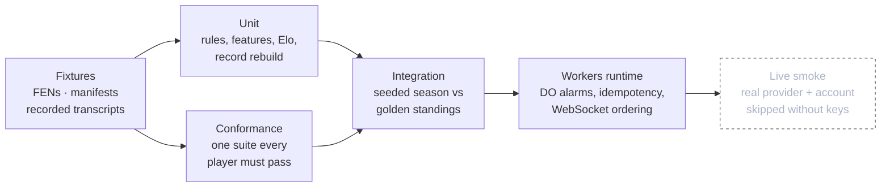
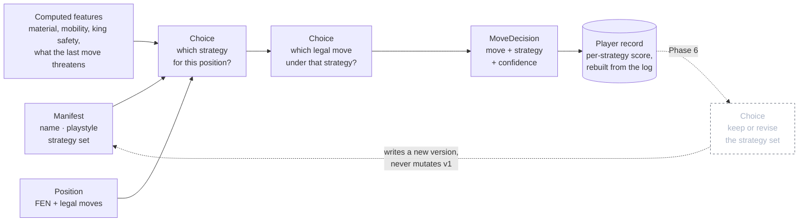
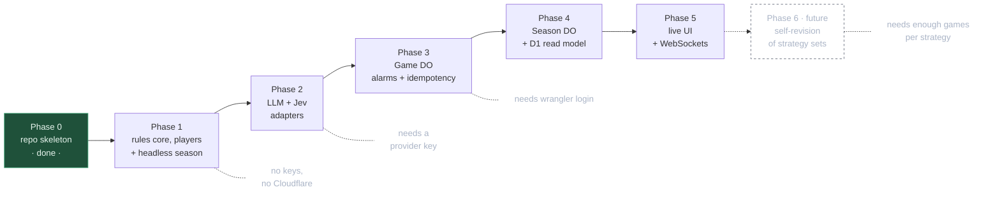
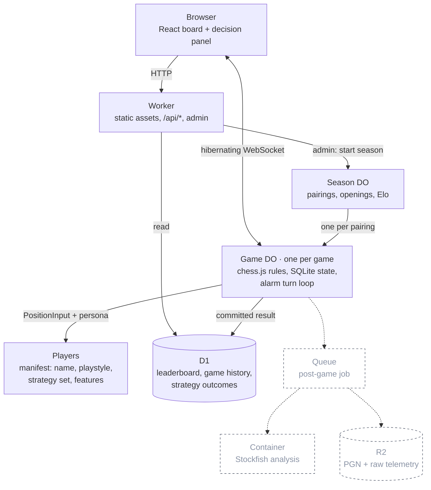
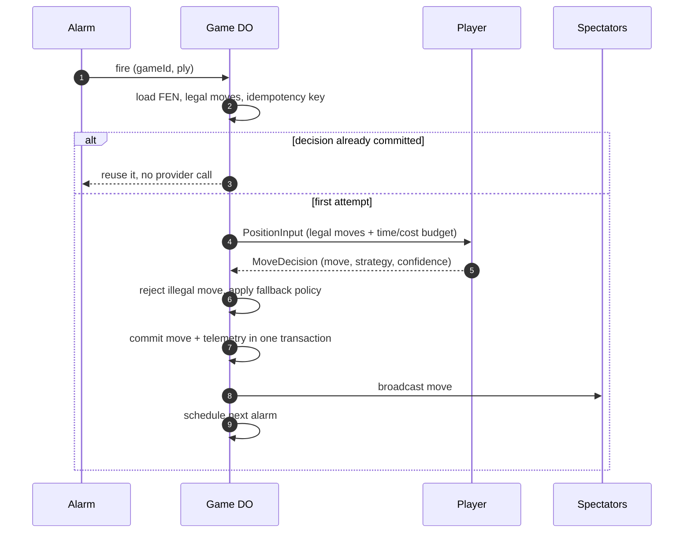

# System One Chess Arena — build plan

Ask: a repo and a plan for the arena described in the vault note
`Project Ideas/System One Chess Arena.md`, built test-first.

What v1 has to prove: a season of games runs start to finish, every move is
legal, and each move leaves a decision record (chosen move, strategy,
confidence, probability distribution, latency, fallback used) so the players can
be compared on strength, speed and calibration. Every player is a named persona
with a declared playstyle and its own derived record, so results attach to an
identity rather than to an anonymous adapter. Strong chess is not a goal.

## How we build

Tests first, everywhere. Each phase begins with a commit that adds only tests,
and those tests fail for the right reason before any implementation exists. A
phase is done when its list is green and nothing outside the list was needed to
get there. Implementation that arrives without its test does not land.

TypeScript, strict, with the types declared before the behaviour. Every shape
lives in `src/core/types.ts`, every module's signature exists before its body,
and an unimplemented body throws `NotImplemented` so a red test names the gap
rather than failing to compile. `bun run no-any` fails the build on `: any`,
`as any`, `any[]`, `<any>`, `as unknown as`, and on `@ts-ignore` or
`@ts-expect-error`, so untrusted input is narrowed from `unknown` instead of
being waved through. `tsconfig` runs `strict`, `noUncheckedIndexedAccess` and
`verbatimModuleSyntax`.

Chess makes this honest: outcomes are deterministic, positions are addressable
by FEN, and the only nondeterminism in the system is randomness, the clock and
the network. All three are injected seams, so every test runs offline and twice
with identical output.

- **Randomness** is a `Rng` passed in, seeded per game from
  `(seasonId, gameId)`. No `Math.random` anywhere in `src/`.
- **Time** is a `Clock` passed in. Latency numbers come from it, so a test can
  assert an exact `latencyMs` and a timeout without sleeping.
- **Network** is a `Provider` interface. Tests use a recorded provider that
  replays JSON transcripts from `__tests__/fixtures/transcripts/`; a `--record`
  run refreshes them from the real API. No test touches the network.
- **Positions** come from a fixture set of FENs with known properties (mate in
  one, forced recapture, stalemate, promotion, en passant, castling rights
  lost, threefold, insufficient material), each with the assertion it exists to
  support.
- **Seasons** are golden: a seeded 20-game season writes standings and a
  decision log that must match a committed golden file byte for byte.

Commands: `bun run check` is typecheck plus the no-any gate plus `bun test`.
`bun run test:workers` runs the Durable Object suites in workerd. `bun test`
alone is the fast loop.

## Test layers



Tooling: `bun test` for everything pure, which is Phases 1, 2 and 6. Durable
Object behaviour (alarms, SQLite, hibernating WebSockets) cannot run under
`bun test`, so Phases 3 to 5 add `vitest` with
`@cloudflare/vitest-pool-workers`, which runs the tests inside workerd with
real alarms and real storage. Confirm that pool's current setup when Phase 3
starts rather than trusting this line. Live smoke tests are a separate,
explicitly-run script that skips itself when the relevant key in `.env` is
blank, so a missing key never turns into a green suite.

## The one contract

Everything else is plumbing around this. Players never touch the board.

```ts
interface CompetitorManifest {
  name: string;             // "Gambit Gwen"
  version: string;          // hash of this manifest; any field change bumps it
  model: string;            // "jev-latest" | "gpt-…" | "greedy" | "random"
  playstyle: string;        // prose persona, passed to the model as state
  strategies: string[];     // the closed set it may pick from (Choice caps at 255)
  features: string[];       // which computed facts it is allowed to see
  historyPlies: number;     // how much of the opponent's play it may see
  fallback: "random-legal" | "greedy" | "first-legal";
  budget: { maxMs: number; maxCostUsd?: number };
}

interface PlayerRecord {    // derived from committed games, never hand-authored
  competitor: string;
  version: string;
  games: number; wins: number; draws: number; losses: number;
  byColour: { white: number; black: number };          // score out of games played
  byStrategy: Record<string, { picks: number; score: number; avgConfidence: number }>;
}

interface PositionInput {
  gameId: string;
  ply: number;
  fen: string;
  history: string[];        // opponent + own recent SAN, capped by historyPlies
  legalMoves: string[];     // UCI, the only choices allowed
  features?: Record<string, number | string | boolean>;  // filtered by manifest
  persona: CompetitorManifest;
  record?: PlayerRecord;    // Phase 6 only: the player's own past results
  budget: { maxMs: number; maxCostUsd?: number };
}

interface MoveDecision {
  move: string;                            // must be in legalMoves
  confidence?: number;
  distribution?: Record<string, number>;   // move -> probability
  strategy?: string;                       // must be one of persona.strategies
  latencyMs: number;
  tokens?: { in: number; out: number };
  fallback?: "timeout" | "illegal-output" | "provider-error";
}

interface Competitor {
  manifest: CompetitorManifest;
  decide(input: PositionInput): Promise<MoveDecision>;
}

// The injected seams that make every test deterministic and offline.
interface Rng { next(): number }                          // seeded per game
interface Clock { now(): number }                         // monotonic ms
interface Provider { ask(req: ProviderRequest): Promise<ProviderResponse> }
```

The game server owns rules via `chess.js` and rejects anything outside
`legalMoves`. A returned illegal move is recorded as `fallback:
"illegal-output"` and the declared fallback policy picks the move.

## Where strategies come from

Strategies are declared, never discovered. The model does no arithmetic and no
statistics: code computes the facts, the manifest says who the player is, and
the model only judges. Two players sharing one model and differing only by
manifest is the experiment, so the manifest is the unit of identity.

- **Playstyle** is prose in the manifest, passed as part of the state.
- **Strategy set** is a closed list in the manifest. A hierarchical player asks
  one `Choice` for the strategy, then one `Choice` for the move under it; a
  flat player skips the first question and records `strategy: "direct"`.
- **Features** are computed by code (material, mobility, king safety, hanging
  pieces, whether a capture is defended, what the opponent's last move
  threatens) and filtered to the list the manifest declares, so "what did this
  player know" is recorded rather than inferred.
- **History** is derived from committed games only, so it can always be rebuilt
  from the decision log. Nothing writes to a record directly.

The invariant that keeps self-revision honest: a manifest is immutable and its
version is a hash of its fields. When a player rewrites its own strategy set it
becomes a new version, and Elo plus history stay attributed to the version that
earned them. Mutating a manifest in place would let a self-revising player
launder a bad record.



Storage: Phase 1 keeps manifests as `competitors/*.json`, decisions as
`runs/<season>/decisions.jsonl`, and rebuilt records as
`runs/<season>/players/<name>@<version>.json`. Phase 4 moves the same three
shapes into D1 as `competitor_versions`, `games` and `strategy_outcomes`.

## Phases

Each phase ends with something runnable, and starts with its tests.



### Phase 0 — repo skeleton

Done: Bun + TypeScript + Wrangler, one health route, typecheck and
`wrangler dev` both verified, `.env` confirmed readable from both Bun scripts
and the Worker, and Durable Object plus D1 bindings in `wrangler.jsonc`.

The test scaffold for every phase is also written and red on purpose: 313 tests
across 24 `bun test` files plus 12 Durable Object tests in the workers pool,
against 27 typed `src/` modules whose bodies throw `NotImplemented`. The two
data-validation suites (position fixtures, openings) pass on real `chess.js`
today, 28 assertions, because their data has to be correct before anything
depends on it. Every other failure is a `NotImplemented` naming the module to
build next, plus one golden-season test asking to be recorded once the runner
works. `compatibility_date` is pinned to `2026-08-22` because the bundled
workerd refuses anything newer.

### Phase 1 — rules core, players and headless season

No Cloudflare, no keys, no network.

Tests first:

- `rules`: the legal-move list matches `chess.js` for every fixture FEN,
  including castling rights lost, en passant, and promotion producing four
  distinct moves; applying a move advances FEN and ply; an illegal move is
  rejected rather than applied.
- `rules/terminal`: mate, stalemate, insufficient material, fifty-move and
  threefold each produce the right result and score, and a game cannot continue
  past a terminal position.
- `features`: material, mobility, hanging pieces, defended-capture and
  king-safety values on fixtures where the answer is countable by hand.
- `features/opponent`: from a fixture where the opponent's last move creates a
  mate threat or attacks a piece, the computed facts name that threat; a
  position where nothing is threatened reports none. This is the test that
  proves a player can read what was just played.
- `features/contract`: a player only receives the feature keys its manifest
  declares, and `history` is truncated to `historyPlies`. A manifest asking for
  an unknown feature key fails to load rather than silently getting nothing.
- `manifest`: the version hash is stable across key order and formatting,
  changes when any field changes, and two manifests with the same fields and
  different names are different players.
- `validation`: a decision whose move is outside `legalMoves` is recorded with
  `fallback: "illegal-output"`; a strategy outside the manifest's set is
  rejected; each fallback policy picks the documented move, and `random-legal`
  with a fixed seed picks the same one twice.
- `players/statistics`: given a distribution, the argmax move is chosen; a tie
  is broken by the seeded `Rng` and is reproducible; a distribution that does
  not sum to one within tolerance, or that names a move outside `legalMoves`,
  is treated as malformed and recorded as such.
- `players/scripted`: the scripted persona picks a defensive strategy in the
  threatened fixture and an aggressive one in the winning-capture fixture, so
  strategy selection is observable before any model exists.
- `elo`: known rating pairs produce the documented update; a draw between equal
  ratings moves nothing; scores are symmetric.
- `record`: rebuilding every `PlayerRecord` from `decisions.jsonl` equals the
  record written during the run, over a generated log as well as the fixtures.
  This pins history as derived, not authored.
- `season` (integration): a seeded 20-game season matches its golden standings
  and golden decision log exactly, and running it twice changes nothing.

Then build: the `chess.js` wrapper and feature computation, manifest loading
with hashed versions, three deterministic players (random, material-greedy, and
one scripted persona), Elo, the JSONL writer, the record rebuilder, and the
runner.

_Check:_ `bun test` green, and `bun run season --games 20` prints standings and
an Elo table that match the golden files.

### Phase 2 — model players

The first phase that can talk to a provider, and the one where most of the
testing effort belongs, because this is where untrusted JSON enters.

Tests first, all offline against recorded transcripts:

- `provider/parsing`, one case per recorded transcript: a well-formed response
  yields the expected `MoveDecision`; and each malformed shape is handled
  without throwing and tagged correctly — missing field, wrong type, null,
  empty body, prose wrapped around the JSON, a move not in `legalMoves`, a
  strategy not in the manifest, probabilities that do not sum to one, an
  unexpected extra field, HTTP 429, HTTP 500, and a socket error.
- `provider/timeout`: with the injected clock past `budget.maxMs`, the decision
  is the declared fallback, tagged `fallback: "timeout"`, and `latencyMs` is
  the elapsed budget, not zero.
- `jev/request`: the Jev adapter sends exactly one `Choice` whose options are
  the legal moves, sends the strategy question only for a hierarchical persona,
  puts playstyle and declared features in the state and nothing else, and never
  sends a question with more than 255 options — the documented split rule is
  exercised on a position with more legal moves than that cap allows.
- `jev/distribution`: the returned probability map is mapped back onto the
  right moves, and confidence is carried through unchanged.
- `conformance`: one suite parameterised over every player, including the
  model ones, asserting across the whole fixture set that the move is always
  legal, the strategy is always in the manifest's set, `latencyMs` is always
  populated, fallbacks are always tagged, and the same input twice with the
  same seed and transcript gives the same decision.
- `live` (separate script, not part of `bun test`): one real call per
  configured provider, skipped with a printed notice when its key is blank.

Then build: the generative LLM player and the Jev player. No
`TYPESAFE_API_KEY` exists yet, so the Jev player runs through the
`system-one-adapter` contract against an ordinary provider until a key arrives;
swapping in the real endpoint is a base-URL change and the conformance suite is
what proves the swap was safe.

_Check:_ `bun test` green with no network, a recorded LLM-versus-greedy game
completes, and the live script makes exactly one real call per key present.

### Phase 3 — `Game` Durable Object

Tests first, under `vitest-pool-workers` so alarms and SQLite are real:

- one alarm advances exactly one ply and schedules the next;
- a duplicate alarm for the same `(gameId, ply, competitorVersion)` calls the
  provider spy once and commits the identical move;
- a failure between decide and commit leaves no partial state, and the retry
  produces one move, not two;
- state survives eviction: reload from SQLite mid-game and the position, clocks
  and decision log are unchanged;
- spectators receive a move only after it is committed, and in ply order;
- a game that reaches a terminal position stops scheduling alarms.

Then build the DO turn loop around them.

_Check:_ the suite is green, and a locally-run game survives an interrupt.

### Phase 4 — `Season` Durable Object and D1 read model

Tests first:

- pairing generation covers every ordered pair once, with colour reversal, and
  is identical for the same seed;
- each pairing gets its seeded opening from the five-opening set;
- the leaderboard read from D1 equals a recount from the games table;
- per-strategy outcomes in `strategy_outcomes` equal a recount from the
  decision log, which is the same assertion Phase 1 makes locally;
- completing an already-completed season is idempotent and does not double
  count ratings;
- a D1 write failure leaves the DO's own authoritative result intact, since D1
  is a projection.

Then build the season state machine, the D1 schema
(`competitor_versions`, `games`, `strategy_outcomes`) and the projection.

_Check:_ one admin POST runs a 20-game season to completion, and both recount
assertions pass against the real D1.

### Phase 5 — live UI

Tests first: a board component renders a fixture FEN to the right squares, an
arriving WebSocket message applies the move, an out-of-order message is
ignored, a dropped connection resubscribes from the last ply cursor without
gaps, and the decision panel shows strategy, confidence and latency from a
fixture decision.

Then build the Vite + React board served from Workers static assets.

_Check:_ the suite is green and two browsers see the same move land within a
second of each other.

### Phase 6 (future) — self-revision

Tests first: a revision produces `v2` while `v1`'s record stays byte-identical;
both versions appear on the leaderboard; a strategy below the minimum sample
threshold cannot trigger a revision; and the revision question is a `Choice`
over the existing set plus the proposal, never free text.

Then build the pre-game revision step, which shows a player its own
`PlayerRecord` as state. This only becomes meaningful once Phase 1's derived
history and Phase 4's per-strategy outcomes are trustworthy, and once enough
games exist per strategy to tell a real edge from variance. The threshold comes
from the Phase 1 numbers, not from a guess now.

## Runtime shape

Everything lives on Cloudflare. Dashed boxes are cut from v1 and have a place
to land later without moving anything else.



One turn, including the part that stops an at-least-once alarm from paying a
provider twice, which is what the Phase 3 suite asserts:



## Cut from the note's lean-first list

R2 artifact storage, the post-game Queue, the Stockfish container analysis
pass, Glicko-2 (plain Elo first), 20 openings down to 5, the GLiNER and
small-local players, and cost-per-dollar metrics. Latency, confidence and the
probability distribution stay, because they are the research artifact.

## Layout

```
.env                      local keys, gitignored (.env.example is committed)
competitors/              one JSON manifest per player
runs/<season>/            decisions.jsonl + players/<name>@<version>.json
src/
  index.ts                Worker entry, exports the Durable Object classes
  core/types.ts           every shape in the system; imported everywhere
  core/errors.ts          NotImplemented, ContractViolation
  core/                   rules, features, position-input, manifest,
                          validation, distribution, rng, clock, env
  players/                random, greedy, scripted, llm, jev
  season/                 pairings, openings, elo, log, record, runner, revision
  live/stream.ts          spectator state reducer (Phase 5 logic)
  do/                     Game and Season Durable Objects (Phase 3+)
scripts/season.ts         headless runner
scripts/no-any.ts         type-safety gate
scripts/live-smoke.ts     the only script that touches a real provider
web/                      Vite React UI (Phase 5)
__tests__/                bun test: core, players, season, live, conformance
  fixtures/positions.ts   FENs with the assertion each one supports
  fixtures/manifests.ts   personas used across suites
  fixtures/transcripts/   recorded provider responses, good and malformed
  fixtures/golden/        seeded season standings and decision log
  helpers/                recorded provider, conformance harness
test-workers/             vitest + workers pool: Durable Object behaviour
```

## Open decisions

1. Which provider key goes in `.env` for the Phase 2 generative player?
2. Deploying needs only `wrangler login`; keys in `.env` are for providers.
   Confirm whether the account is on Workers Paid before Phase 3, since the
   Durable Object free-tier limits decide whether a full season can run there.
3. Phase 1 alone answers "does a typed decision model beat a greedy heuristic".
   Stop there and look at the numbers, or push through to the live site?
4. Who writes the starting personas, and how many? I would open with four:
   `random`, `greedy`, one scripted persona to prove the strategy plumbing, and
   one model persona in Phase 2.
5. Does this need CI on GitHub? If yes, `bun test` runs with no secrets, and
   only a deploy job would need an account id and API token as repo secrets.
