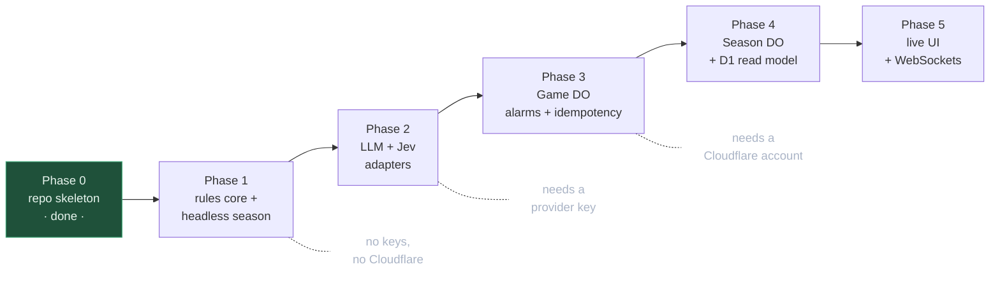
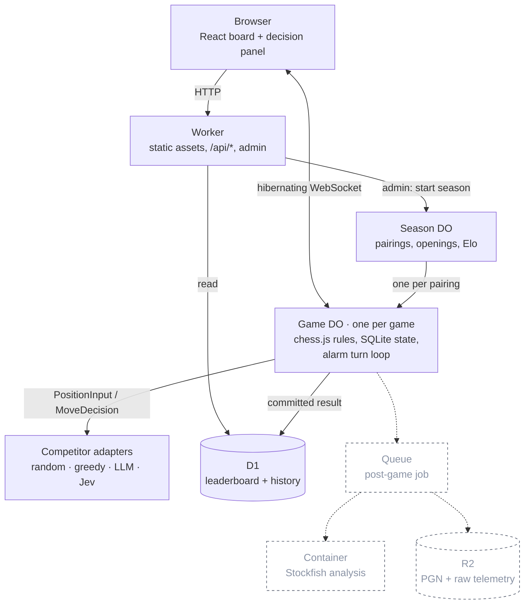
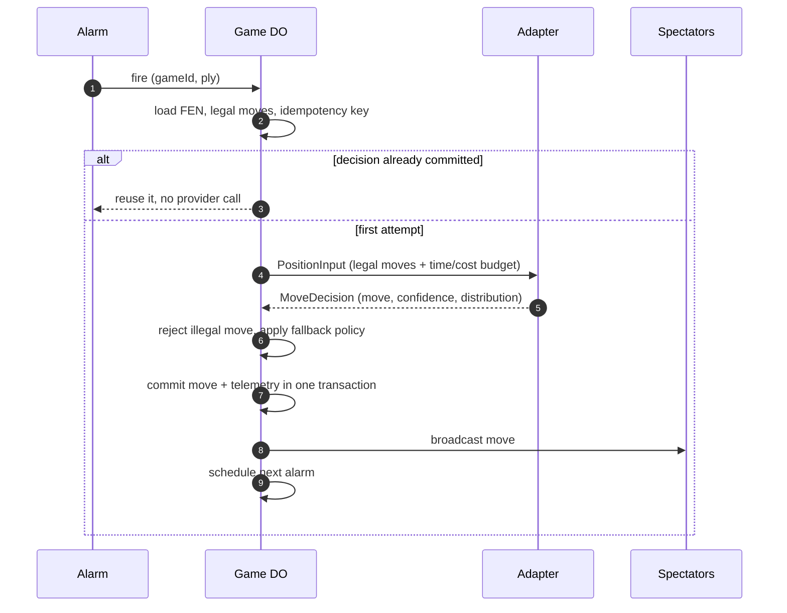

# System One Chess Arena — build plan

Ask: a repo and a plan for the arena described in the vault note
`Project Ideas/System One Chess Arena.md`.

What v1 has to prove: a season of games runs start to finish, every move is
legal, and each move leaves a decision record (chosen move, confidence,
probability distribution, latency, fallback used) so the adapters can be
compared on strength, speed and calibration. Strong chess is not a goal.

## The one contract

Everything else is plumbing around this. Adapters never touch the board.

```ts
interface PositionInput {
  gameId: string;
  ply: number;
  fen: string;
  history: string[];        // recent SAN, bounded
  legalMoves: string[];     // UCI, the only choices allowed
  features?: Record<string, number | string | boolean>;  // per-league contract
  budget: { maxMs: number; maxCostUsd?: number };
}

interface MoveDecision {
  move: string;                            // must be in legalMoves
  confidence?: number;
  distribution?: Record<string, number>;   // move -> probability
  strategy?: string;                       // e.g. "attack", "simplify"
  latencyMs: number;
  tokens?: { in: number; out: number };
  fallback?: "timeout" | "illegal-output" | "provider-error";
}

interface Competitor {
  name: string;
  version: string;                         // manifest is immutable; changes bump this
  decide(input: PositionInput): Promise<MoveDecision>;
}
```

The game server owns rules via `chess.js` and rejects anything outside
`legalMoves`. A returned illegal move is recorded as `fallback:
"illegal-output"` and the declared fallback policy picks the move.

## Phases

Each phase ends with something runnable. No phase starts before the one above
it passes its check.



**Phase 0 — repo skeleton.** Done: Bun + TypeScript + Wrangler, one health
route, typecheck and `wrangler dev` both work.

**Phase 1 — rules core and headless season.** No Cloudflare at all. A
`chess.js` wrapper that produces `PositionInput` and applies a validated
`MoveDecision`, plus two deterministic adapters (random, material-greedy) and a
local runner that plays N games and writes decision records as JSONL.
_Check:_ `bun run season --games 20` prints standings and an Elo table, and the
JSONL contains no illegal move and no missing terminal result.

**Phase 2 — model adapters.** A generative LLM adapter that gets the legal-move
list and must return one of them, and the Jev adapter written against the
`/v1/systemone` `Choice` shape. No `TYPESAFE_API_KEY` exists yet, so the Jev
adapter routes through the `system-one-adapter` contract against an ordinary
provider until a key arrives; swapping in the real endpoint is a base-URL
change.
_Check:_ LLM vs material-greedy completes a game; a deliberately illegal
response produces a logged fallback instead of a crash.

**Phase 3 — `Game` Durable Object.** Move the Phase 1 turn loop into a
SQLite-backed DO driven by alarms, with an idempotency key of
`(gameId, ply, competitorVersion)` so an at-least-once alarm reuses the
committed decision instead of calling the provider twice. Commit move plus
telemetry in one transaction, then broadcast.
_Check:_ interrupt a game mid-way and it resumes on the next alarm; a forced
duplicate alarm records one provider call, not two.

**Phase 4 — `Season` Durable Object and D1 read model.** Round-robin pairings
with colour reversal over 5 seeded openings, immutable competitor manifests,
plain Elo, and D1 tables for the public leaderboard and game history.
_Check:_ one admin POST runs a 20-game season to completion; the leaderboard
endpoint returns standings that match the DO's own results.

**Phase 5 — live UI.** Vite + React board served from Workers static assets,
one live game over hibernating WebSockets, and a panel showing the last
decision (move, strategy, confidence, latency).
_Check:_ two browsers see the same move land within a second of each other.

## Runtime shape

Everything lives on Cloudflare. Dashed boxes are cut from v1 and have a place
to land later without moving anything else.



One turn, including the part that stops an at-least-once alarm from paying a
provider twice:



## Cut from the note's lean-first list

R2 artifact storage, the post-game Queue, the Stockfish container analysis
pass, Glicko-2 (plain Elo first), 20 openings down to 5, the GLiNER and
small-local adapters, and cost-per-dollar metrics. Latency, confidence and the
probability distribution stay, because they are the research artifact.

## Layout

```
src/
  index.ts          Worker entry: API routes, later static assets + WS upgrade
  core/             chess.js wrapper, PositionInput/MoveDecision, validation
  adapters/         one file per competitor, all implementing Competitor
  season/           pairings, openings, Elo
  do/               Game and Season Durable Objects (Phase 3+)
scripts/season.ts   headless runner (Phase 1)
web/                Vite React UI (Phase 5)
__tests__/
```

## Open decisions

1. Which LLM provider key is available locally for the Phase 2 generative
   adapter?
2. Is there a Cloudflare account to deploy against, and is it on Workers Paid?
   Containers need Paid; check the current Durable Object SQLite free-tier
   limits before assuming Phase 3 deploys for free.
3. Phase 1 alone answers "does a typed decision model beat a greedy heuristic".
   Stop there and look at the numbers, or push through to the live site?
